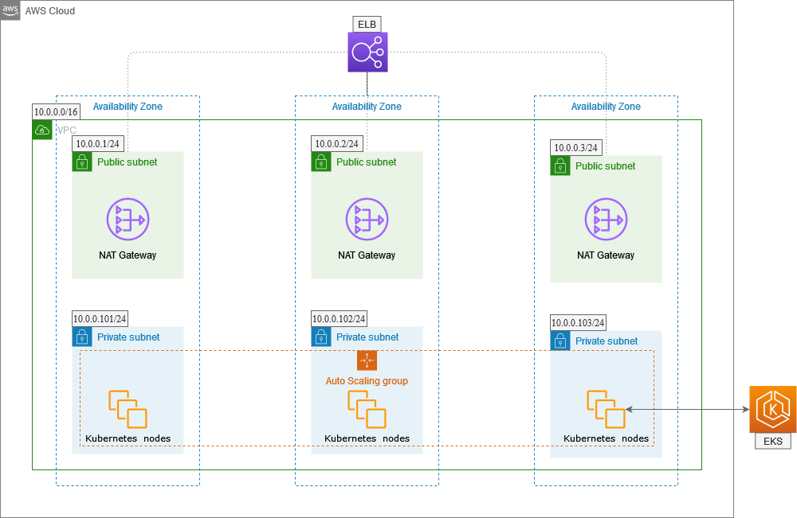
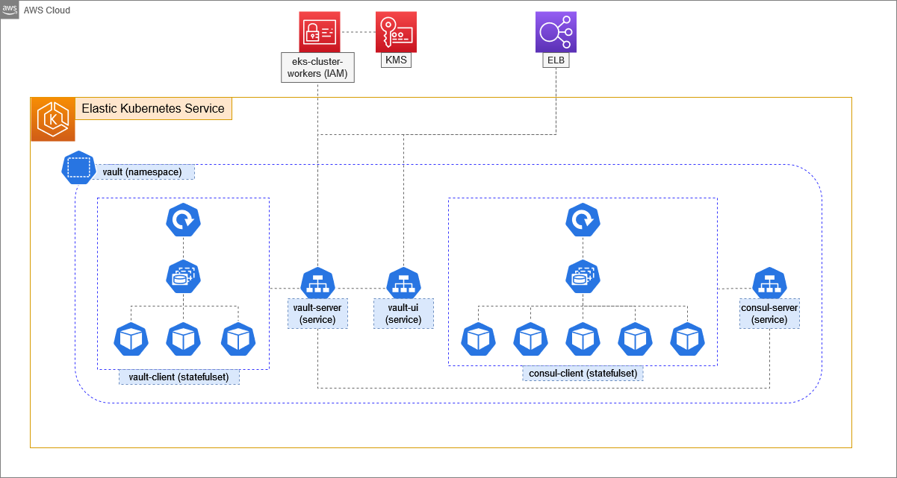

# Vault on EKS with Terraform

**This project is currently in development**

## Architecture

Here you can see some diagrams describing the architecture of this project.

### VPC with an EKS Cluster

In order to achieve high availability we're deploying the cluster to three Availability Zones
with the nodes being an EC2 Auto Scaling Group.



### Vault on Kubernetes

> We're using Consul to store Vault data.

On top of the cluster above mentioned we deploy Vault and Consul with StatefulSets
to, again, ensure high availability.

> StatefulSets are built on top of a Deployment, who handles the replication of Pods.



## Instalation

The steps to spin up the infrastructure if declared within each environment.

## Post Instalation

After everything is setup you should be able to access Vault via CLI.

> Thanks to the VAULT_ADDR environment variable

So to read the database credentials created by Terraform:

```sh
vault login $VAULT_TOKEN
```
```sh
vault kv get static/database
```

> If you don't have the Vault CLI installed, you can get it [here](https://www.vaultproject.io/docs/install)

And with the credentials in hand you can access the MySQL Database:
```sh
mysql \
  -h $(terraform output -json database | jq -r .address) \
  -P $(terraform output -json database | jq -r .port) \
  -u '{THE_USERNAME_DECLARED_ON_TFVARS}' -p
```

> If you don't have MySQL installed, you can get it [here](https://dev.mysql.com/doc/mysql-shell/8.0/en/mysql-shell-install.html)
